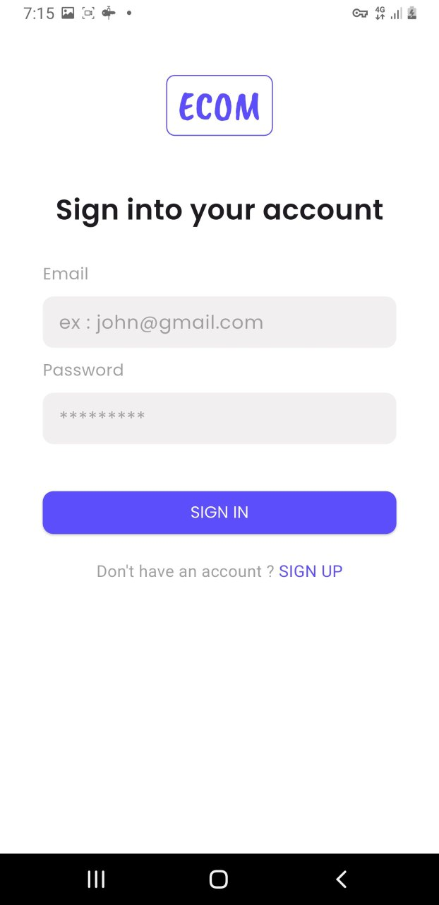

# g6_assessment

A Flutter project for chat and authentication with clean architecture and socket.io integration.

## Getting Started

This project is a starting point for a Flutter application with features like:

- Splash screen
- User login and signup
- Real-time chat room with socket.io
- Dependency injection and BLoC pattern

### Resources

If you're new to Flutter, here are some useful links to get started:

- [Write your first Flutter app (Flutter docs)](https://docs.flutter.dev/get-started/codelab)
- [Flutter Cookbook (Useful samples)](https://docs.flutter.dev/cookbook)
- [Flutter Official Documentation](https://docs.flutter.dev/)

---

## Screenshots

### Splash Screen


### Login Page


### Signup Page


### Chat Room


### List of Chats


---

## How to Run

1. Make sure you have Flutter installed. If not, follow the instructions [here](https://flutter.dev/docs/get-started/install).
2. Clone this repository:
   ```bash
   git clone https://github.com/yourusername/g6_assessment.git
